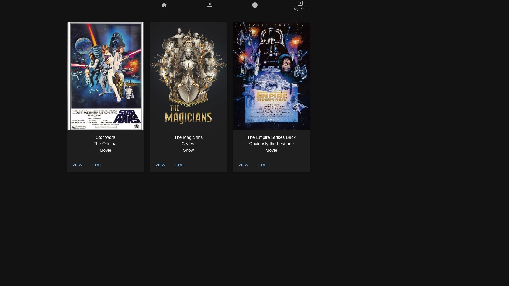
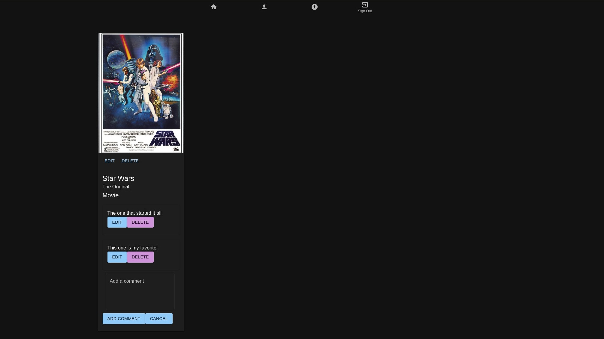
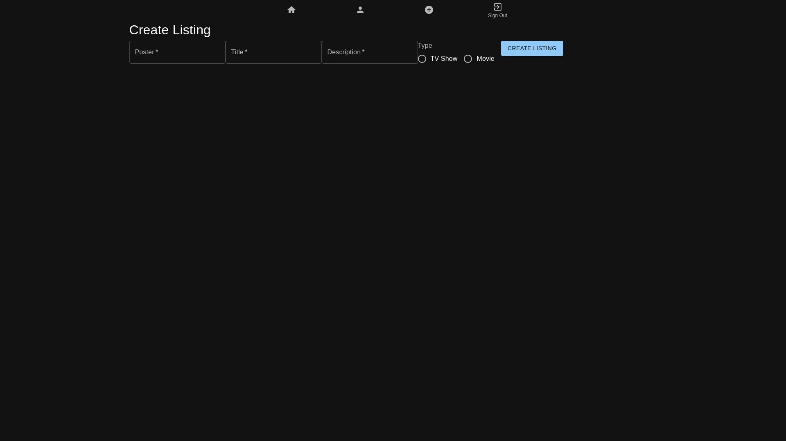
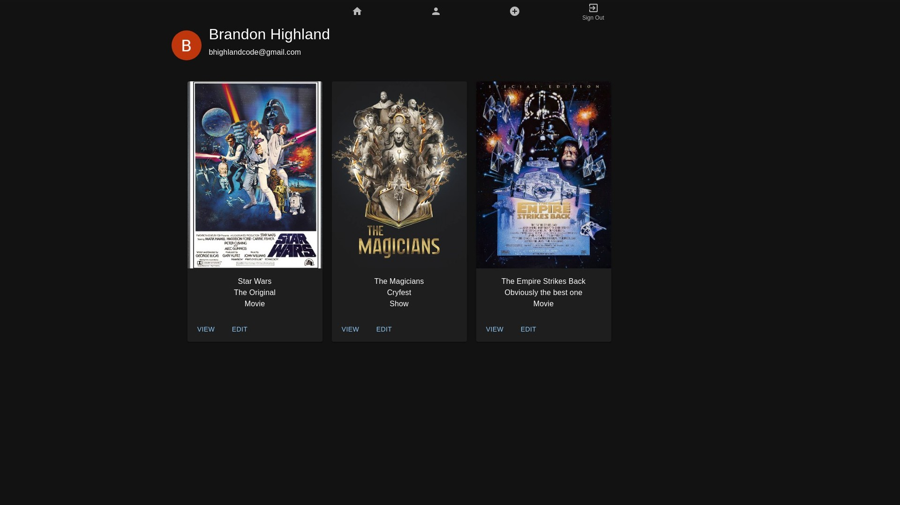

# Movie Night  

Movie Night is an app to keep track of the shows and movies you're watching with a partner.

## About the User
- This app is useful for anyone who wants to keep track of the shows and movies they're watching with a partner, especially if they're in a long distance relationship or have a busy schedule. Movie Night allows users to keep track of what they're watching and leave comments for their partner to read later.

## Features
- Users login to the app using Google Authentication
- Users are able to view a list of shows and movies they're watching with another user in their watch group
- Users can create a listing for a new show or movie they want to watch with another user
- Users can delete or update a show or movie listing
- Users can add comments to a show or movie listing
- Users can update or delete their comments
- Users can view a list of all the shows and movies they've added to their watch group on their profile page

## Relevant Links
- Deployed site
- [Wireframes](https://www.figma.com/file/2AV8KzOsaJlF1D4gE3IMtb/Movie-Night?type=design&node-id=0-1&t=A68HIDuv99lJW267-0)

## Project Screenshots

## Contributors
- [Brandon Highland](https://github.com/users/bhighlander)
