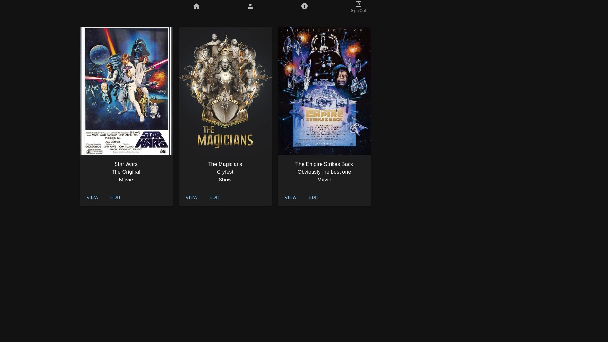
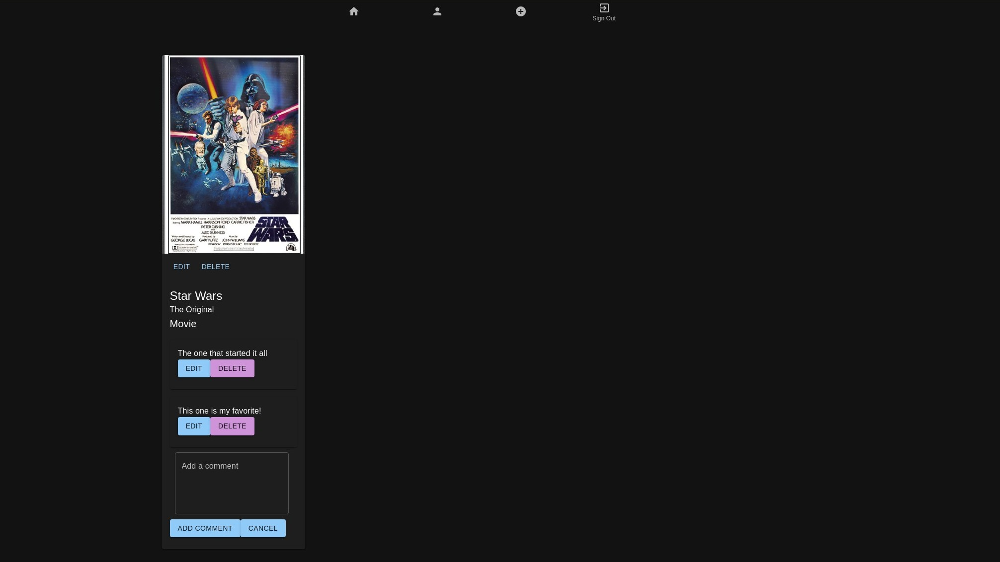
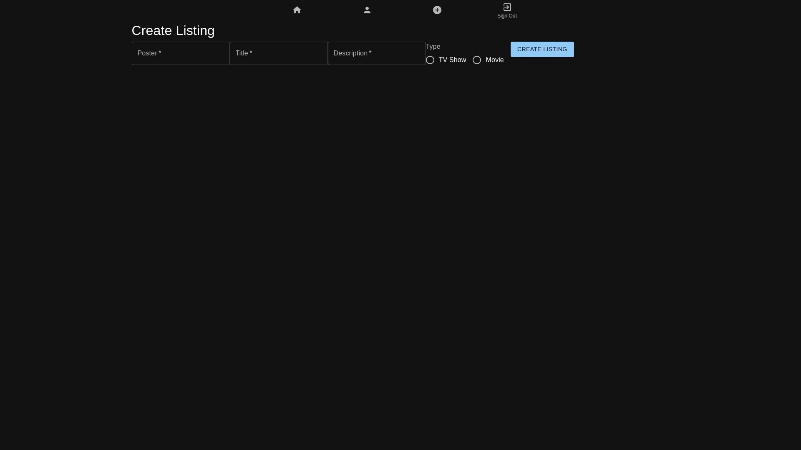
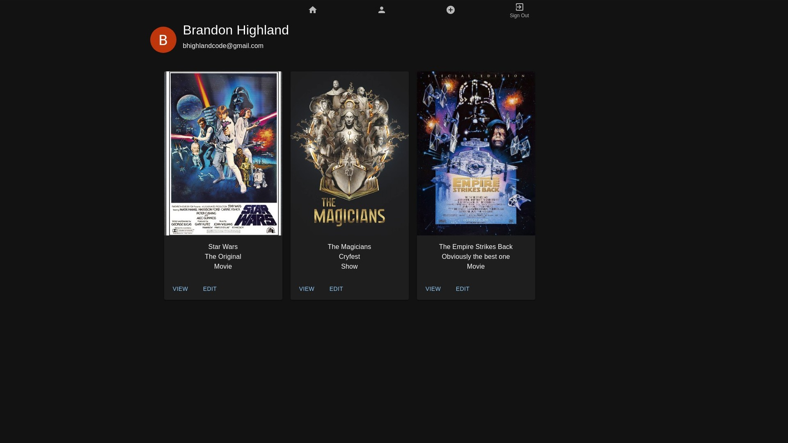

# Movie Night

Movie Night is an app to keep track of the shows and movies you're watching with a partner.

## About the User
- This app is useful for anyone who wants to keep track of the shows and movies they're watching with a partner, especially if they're in a long distance relationship or have a busy schedule. Movie Night allows users to keep track of what they're watching and leave comments for their partner to read later.

## Features
- Users login to the app using Google Authentication
- Users are able to view a list of shows and movies they're watching with another user in their watch group
- Users can create a listing for a new show or movie they want to watch with another user
- Users can search the TMDB API for a show or movie to add to listings
- Users can delete or update a show or movie listing
- Users can add comments to a show or movie listing
- Users can update or delete their comments
- Users can view a list of all the shows and movies they've added to their watch group on their profile page

## Getting Started
- Clone the repo and run `npm install` to install dependencies
- Run `npm run prepare`
- Run `npm run dev` to start the app in development mode

## Relevant Links
- [Deployed site](https://capstone-movie-night.vercel.app/)
- [Wireframes](https://www.figma.com/file/2AV8KzOsaJlF1D4gE3IMtb/Movie-Night?type=design&node-id=0-1&t=A68HIDuv99lJW267-0)
- [ERD](https://dbdiagram.io/d/64631145dca9fb07c425afe7)
- [Loom Video](https://drive.google.com/file/d/1a3c6iCjwDJo7YZBq50kxjdFaSulfxur1/view?usp=sharing)

## Project Screenshots

## Contributors
- [Brandon Highland](https://github.com/users/bhighlander)
